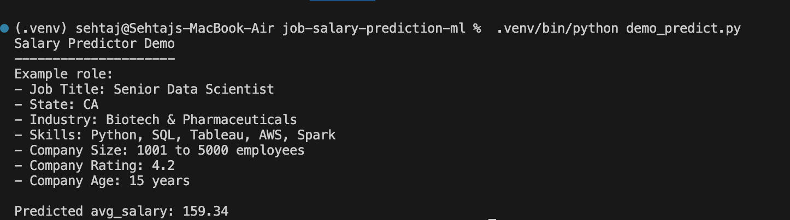
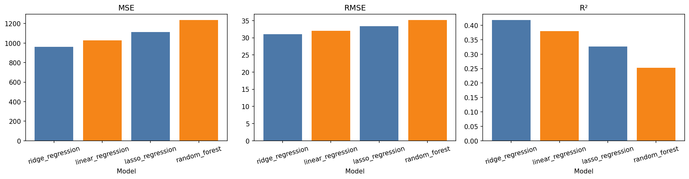
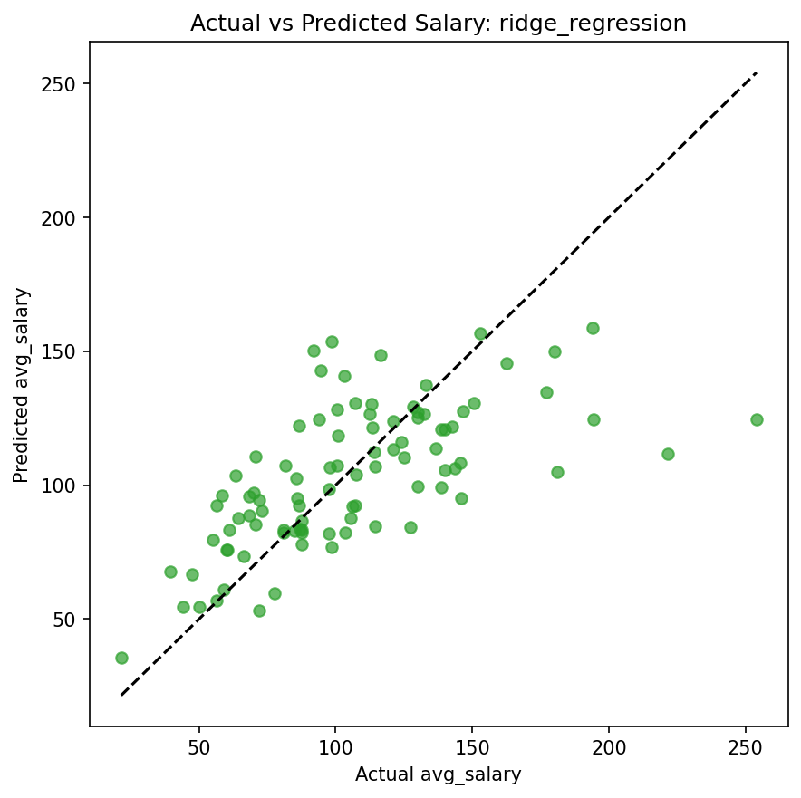
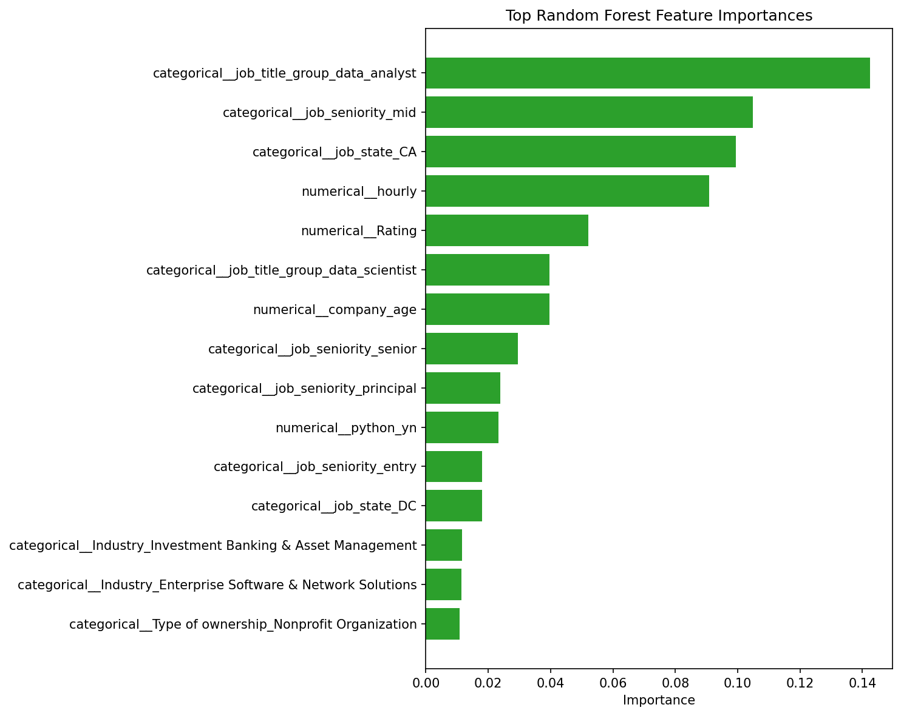

# Salary Prediction Using Job and Company Features

This project predicts average salary (`avg_salary`) from structured job-posting and company features using machine learning. It is a completed Version 1 tabular ML project with a full pipeline for data preparation, model comparison, evaluation, diagnostics, and reusable prediction.



## Overview

The project answers a simple question:

**Given job and company details, can we estimate the likely average salary for that role?**

The model uses features such as:
- job title
- company rating
- company size
- industry and sector
- revenue and ownership type
- state/location
- skill indicators such as Python, R, Spark, AWS, Excel, SQL, and Tableau

Target variable:
- `avg_salary`

Primary dataset:
- `data/raw/salary_data_cleaned.csv`

## Dataset Credit

This project uses the Kaggle dataset **Jobs Dataset From Glassdoor** by **thedevastator**:

https://www.kaggle.com/datasets/thedevastator/jobs-dataset-from-glassdoor/data

Acknowledgement from the dataset source: the data was scraped from Glassdoor.com by **Ramiro Gomez**.

The dataset is listed under **CC0 1.0 Universal (Public Domain)**, and attribution is included here for academic and project transparency.

## Final Result

Four Version 1 models were trained and compared:
- `Linear Regression`
- `Ridge Regression`
- `Lasso Regression`
- `Random Forest Regressor`

Final selected model:
- `Ridge Regression`

Held-out test metrics for the selected model:
- `MSE = 962.6841`
- `RMSE = 31.0272`
- `R² = 0.4181`

Cross-validation also supported the same conclusion:
- `ridge_regression` had the best average cross-validated RMSE among the tested models

## Project Preview

### Model Comparison


### Actual vs Predicted Salary


### Feature Importance


## What The Project Shows

- a complete end-to-end machine learning pipeline
- leakage-aware feature selection
- structured feature engineering
- categorical encoding and reusable preprocessing
- model training and comparison
- feature-importance interpretation
- cross-validation and residual diagnostics
- a reusable salary prediction workflow

## Key Findings

- `Ridge Regression` performed best on the held-out test set and remained the most stable model under cross-validation.
- A denser Ridge alpha search with shuffled 10-fold cross-validation improved the final Ridge baseline.
- A tuned `Random Forest` improved substantially over its untuned baseline, but it still did not beat Ridge.
- Job title grouping, job seniority, job state, industry, revenue, and other company-context features were among the strongest salary signals.
- Ridge struggled most with leadership/director roles and higher salary bands, which was surfaced through residual diagnostics.

## Quick Demo

If someone asks, “show me how it works,” run:

```bash
.venv/bin/python demo_predict.py
```

That loads the saved Ridge pipeline and prints one clean example prediction.

## Project Structure

```text
job-salary-prediction-ml/
├── data/
│   ├── raw/
│   ├── processed/
│   └── splits/
├── models/
├── results/
│   ├── diagnostics/
│   ├── eda/
│   ├── evaluation/
│   ├── feature_importance/
│   ├── final/
│   └── predictions/
├── src/
├── PROGRESS.md
├── README.md
├── demo_predict.py
└── requirements.txt
```

## Core Files

- `src/data_loading.py`: load and inspect the raw dataset
- `src/eda.py`: exploratory data analysis and visual outputs
- `src/data_cleaning.py`: clean duplicates, placeholders, and missing values
- `src/feature_engineering.py`: build the Version 1 modeling dataset
- `src/preprocessing.py`: scale numeric features and one-hot encode categorical features
- `src/data_splitting.py`: create train/test splits
- `src/model_registry.py`: define the baseline models
- `src/train_model.py`: train and save model pipelines
- `src/evaluate_model.py`: evaluate all models on the held-out test set
- `src/feature_importance.py`: analyze coefficients and feature importances
- `src/predict_salary.py`: reusable prediction logic
- `src/model_diagnostics.py`: cross-validation and Ridge residual analysis
- `demo_predict.py`: one-command demo for presenting the model

## Setup

From the project root:

```bash
python3 -m venv .venv
source .venv/bin/activate
pip install -r requirements.txt
```

## End-to-End Run Order

```bash
.venv/bin/python -m src.data_loading
.venv/bin/python -m src.eda
.venv/bin/python -m src.data_cleaning
.venv/bin/python -m src.feature_engineering
.venv/bin/python -m src.preprocessing
.venv/bin/python -m src.data_splitting
.venv/bin/python -m src.train_model
.venv/bin/python -m src.evaluate_model
.venv/bin/python -m src.feature_importance
.venv/bin/python -m src.predict_salary
.venv/bin/python -m src.model_diagnostics
```

## Important Outputs

Evaluation:
- `results/evaluation/model_metrics.csv`
- `results/evaluation/model_comparison.png`
- `results/evaluation/best_model_actual_vs_predicted.png`
- `results/evaluation/evaluation_report.md`

Feature importance:
- `results/feature_importance/feature_importance_report.md`
- `results/feature_importance/linear_regression_top_coefficients.png`
- `results/feature_importance/random_forest_top_importances.png`

Diagnostics:
- `results/diagnostics/cross_validation_metrics.csv`
- `results/diagnostics/diagnostics_report.md`
- `results/diagnostics/ridge_residuals_vs_actual.png`

Prediction:
- `results/predictions/sample_predictions.csv`
- `results/predictions/prediction_report.md`

Final summary:
- `results/final/final_project_summary.md`

## How To Interpret The Model

This model is best understood as a **salary estimator**, not a precise compensation calculator.

Why:
- the dataset is relatively small
- salary depends on hidden factors not fully present in the data
- even similar roles can have wide salary variation

So the model is most useful for:
- rough salary estimation
- comparing role profiles
- understanding what features tend to push salary higher or lower
- demonstrating a strong machine learning workflow

## Limitations

- The project uses a relatively small tabular dataset.
- It does not yet include richer NLP features from full job descriptions.
- The model error is still large enough that predictions should be treated as directional estimates, not exact salary quotes.
- Version 1 is intentionally structured-data only.

## Next Step

The natural extension is a Version 2 workflow with:
- larger or richer salary data
- job-description NLP features
- broader modeling experiments
- possibly a user-facing app or web demo
